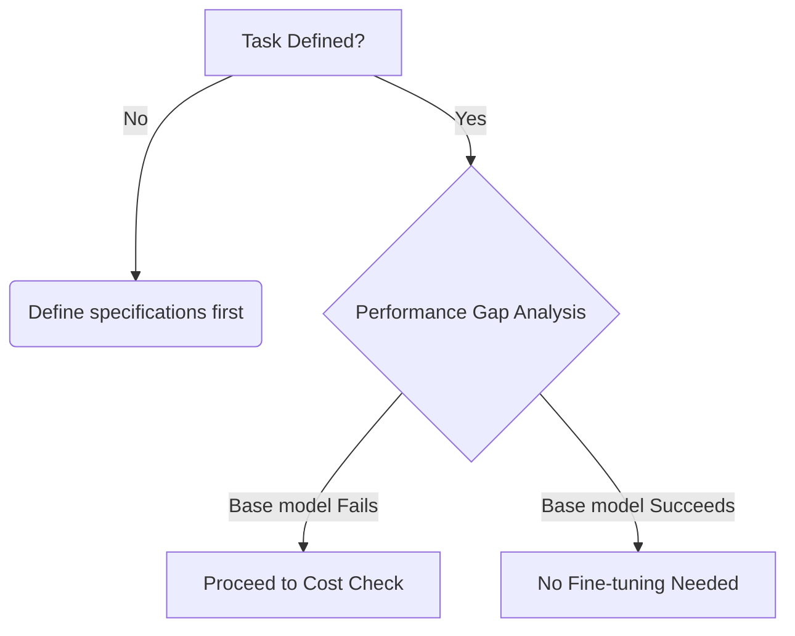
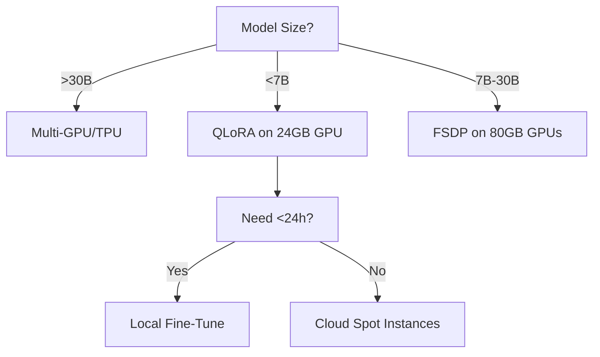

# What is fine-tuning, and why is it needed?

**Fine-tuning** is the process of taking a pre-trained Large Language Model (LLM) and further training it on a smaller, task-specific dataset to adapt its knowledge and behavior for specialized applications. It involves continuing the training process with new data while leveraging the general language understanding acquired during pre-training.

### Why Fine-Tuning Is Needed:
1.  **Domain Adaptation:** Pre-trained LLMs learn general language patterns from massive web-scale datasets but lack specialized knowledge for domains like medical diagnostics, legal contracts, or technical documentation. Fine-tuning injects domain-specific knowledge.
   
2.  **Task Specialization:** LLMs are pre-trained for broad next-token prediction, not specialized tasks like sentiment analysis or named entity recognition. Fine-tuning reorients the model toward these objectives.

3.  **Behavioral Control:** Adjusts model outputs to match desired styles (e.g., formal vs. casual), safety guardrails (e.g., refusing harmful requests), or response formats (e.g., JSON output).

4.  **Data Efficiency:** Requires far fewer examples (hundreds to thousands vs. billions) than training from scratch by leveraging pre-existing linguistic representations.

5.  **Performance Boosts:** Consistently outperforms zero-shot or few-shot prompting on specialized benchmarks (e.g., BioBERT improves biomedical NER accuracy by 5-10% over base BERT).

6.  **Custom Vocabulary Integration:** Adapts models to understand proprietary terminology, industry jargon, or newly coined terms not present in pre-training data.

**Core Mechanism:** During fine-tuning:
- The model's weights are updated via backpropagation
- Task-specific layers (e.g., classification heads) are often added
- Learning rates are typically 10-100x lower than pre-training
- Batch sizes are smaller due to limited domain data
- Only 1-5% of original training compute is usually required

# Which scenario do we need to fine-tune LLM?

Fine-tuning is most valuable in these scenarios:

1.  **High-Stakes Domains:**
    - Healthcare: Diagnosing conditions from patient notes
    - Legal: Contract clause extraction or compliance checking
    - Finance: Earnings report analysis or regulatory risk assessment

2.  **Style/Format Constraints:**
    - Generating responses matching brand voice guidelines
    - Producing API-compatible outputs (XML/JSON/YAML)
    - Adhering to strict factual reporting standards

3.  **Proprietary Knowledge:**
    - Internal documentation QA systems
    - Company-specific acronym expansions
    - Product catalog attribute extraction

4.  **Low-Resource Languages:** Adapting existing multilingual models (e.g., mBERT) for languages with limited training data.

5.  **Safety-Critical Applications:**
    - Content moderation with custom policy rules
    - Toxic speech detection thresholds
    - Hallucination suppression mechanisms

6.  **Performance-Sensitive Tasks:**
    - When latency requirements prevent complex prompt engineering
    - When few-shot prompting fails to meet accuracy targets
    - When handling edge cases not addressed by base models

**When NOT to Fine-Tune:**
- For general knowledge questions
- Rapid prototyping of ideas
- When prompt engineering solves the problem adequately
- When task data changes dynamically (requiring constant retraining)
- With insufficient quality training data (<500 curated examples)

# How to make the decision of fine-tuning?

Use this structured decision framework:

### 1. Evaluate Task Requirements


### 2. Assess Resource Availability
- **Data:** Do you have ≥500 high-quality, domain-specific examples? (Ideal: 5K-50K)
- **Compute:** Can you access GPUs (e.g., A100 80GB) for 4-48 hours?
- **Expertise:** Do you have ML engineers for:
  - Hyperparameter tuning
  - Loss monitoring
  - Overfitting prevention

### 3. Compare Alternatives
| Technique               | Effort   | Cost     | Use Case                  |
|-------------------------|----------|----------|---------------------------|
| Zero-shot Prompting      | Low      | $        | Simple Q&A                |
| Few-shot Prompting       | Medium   | $$       | Pattern-based tasks       |
| Retrieval-Augmentation | Medium   | $$$      | Dynamic knowledge needs   |
| **Fine-tuning**          | **High** | **$$$$** | **Specialized behaviors** |

### 4. Conduct Feasibility Testing
1. Run baseline tests with prompt engineering
2. Annotate 100-500 samples for quick validation
3. Use parameter-efficient methods (LoRA) for fast prototyping
4. Measure delta against business KPIs:
   - Minimum accuracy gain target (e.g., +15% F1 score)
   - Maximum latency reduction (e.g., <500ms)

**Decision Threshold:** Proceed if:
- Accuracy gap >20% over prompting
- Data/compute resources available
- ROI justifies engineering costs
- No alternative solution meets requirements

# How do you improve the model to answer only if there is sufficient context for doing so?

Implement a multi-layer **confidence-based response control system**:

### 1. Context Sufficiency Detection
```python

def is_context_sufficient(query, context):
    # Semantic similarity check
    if cosine_sim(query_emb, context_emb) < 0.3:
        return False
    # Named entity verification
    if query_entities not in context_entities:
        return False
        
    # Logical premise evaluation
    if not validate_premises(query, context):
        return False
        
    return True
```
### 2. Confidence Calibration Techniques
- **Perplexity Thresholding:** Reject responses when output perplexity > 250 (indicates uncertainty)
- **Monte Carlo Dropout:** Run 10 forward passes with dropout enabled; reject if variance > 0.4
- **Entropy Regularization:** Penalize low-confidence outputs during fine-tuning:
  `loss += lambda * entropy(output_distribution)`

### 3. Architectural Modifications
- Add **rejection classification head** during fine-tuning:
  - Binary output: (Answer/Reject)
  - Trained with "insufficient context" examples
- Implement **certainty gates** in decoder layers:

```python
if layer.confidence < threshold:
    output = "[I cannot answer based on provided context]"
```
### 4. Training Data Curation
- Generate adversarial examples:
  - Questions missing key premises
  - Contexts with contradictory information
  - Ambiguous references requiring clarification
- Balance dataset with "I don't know" cases (15-20% of fine-tuning data)

### 5. Inference Guardrails
- **Context-Source Verification:**
```python
if not context.has_cited_sources():
    return "I need verified sources to answer this"
```

- **Temporal Grounding:** Reject questions about future events beyond context date range
- **Quantification Checks:** Require explicit quantities for math/reasoning questions

**Validation Metrics:**
1. False Positive Rate (FPR): % of incorrect answers not rejected
2. False Negative Rate (FNR): % of correct answers incorrectly rejected
3. Coverage: % of queries receiving valid answers
4. User Satisfaction: A/B test scores for response appropriateness

**Deployment:** Continuously monitor with canary releases and confidence calibration error scoring.

# How to create fine-tuning datasets for Q&A?

Creating high-quality question-answering datasets involves systematic data collection, curation, and formatting:

1.  **Define Task Scope:**
    *   Determine Q&A type: ``Open-domain`` (general knowledge), ``Closed-domain`` (specific context), ``Extractive`` (answers from text), or ``Generative`` (free-form answers).
    *   Set requirements: Answer length, citation needs, and domain specialization.

2.  **Data Collection Strategies:**
    *   ``Public Datasets``: Curate from existing resources (SQuAD, Natural Questions, CoQA) with proper licensing.
    *   ``Synthetic Generation``: Use LLMs (e.g., GPT-4) to:
        - ``Question Generation``: Feed context passages → output Q&A pairs
        - ``Answer Generation``: Provide (context + question) → generate answers
        - ``Data Augmentation``: Paraphrase existing Q&As
    *   ``Human Annotation``:
        - **Expert Creation**: Domain specialists write context + Q&As
        - **Convert Documents**: Annotators create Q&As from internal docs (PDFs, wikis)
        - **Adversarial Examples**: Include hard negatives to improve robustness

3.  **Data Formatting:**

```json

{

"context": "Transformers use self-attention to process sequences...",

"question": "What mechanism allows Transformers to handle long-range dependencies?",

"answer": "self-attention"

}
```

*   For generative tasks, include ``instruction templates``: 
    `### Instruction: {question} ```n### Context: {context} ```n### Response: {answer}`

4.  **Quality Control:**
*   ``Filtering``: Remove low-quality samples (typos, unanswerable questions)
*   ``Validation``: Human review for accuracy and relevance (e.g., 10% sample)
*   ``Debiasing``: Balance question types and demographics

5.  **Tooling:**
*   Label Studio / Prodigy for annotation
*   LlamaIndex for document parsing
*   `datasets` library for versioning/curation

---

# How to set hyperparameters for fine-tuning?

Hyperparameter optimization requires balancing performance, speed, and resource limits:

1.  ``Learning Rate (Most Critical)``:
*   ``Range``: 1e-6 to 5e-5 for full fine-tuning; 1e-4 to 1e-3 for LoRA
*   ``Strategies``:
    - **Linear Decay**: Start high → reduce over steps
    - **Warmup**: Gradually increase LR (first 3-10% of steps)

2.  ``Batch Size``:
*   Max GPU-memory allows (use gradient accumulation for larger effective batches)
*   ``Recommendations``: 16-128 for consumer GPUs; 256-1024 for data centers

3.  ``Epochs``:
*   Domain adaptation: 1-3 epochs
*   Drastic task changes: 5-10 epochs
*   **Early Stopping**: Monitor validation loss (patience=2-3 epochs)

4.  ``Optimizer Choice``:
*   `AdamW`: Default choice (weight decay=0.01)
*   `bitsandbytes` AdamW 8-bit: For memory efficiency

5.  ``Parameter-Efficient Methods``:
*   **LoRA Settings**: 
    ``Rank`` (8-64), ``alpha`` (16-64), target modules (`q_proj`, `v_proj`)
*   ``QLoRA``: 4-bit quantization + LoRA (NF4 dtype)

6.  ``Regularization``:
*   Dropout: 0.1-0.3
*   Weight Decay: 0.01-0.1

**Tuning Workflow:**
1. Start with ``recommended defaults`` (e.g., HuggingFace Trainer presets)
2. Run ``learning rate sweep`` (LR range test)
3. Scale ``batch size`` until GPU OOM, then use gradient accumulation
4. Use ``Bayesian optimization`` (Optuna, Ray Tune) for >3 hyperparameters
5. ``Validate every 500 steps`` with 10% holdout data

**Example Configuration (7B LLM w/QLoRA):**
```yaml

learning_rate: 3e-4

per_device_train_batch_size: 8

gradient_accumulation_steps: 4

num_train_epochs: 3

optim: paged_adamw_8bit

lora_r: 32

lora_alpha: 64

target_modules: [q_proj, v_proj]
```
---

# How to estimate infrastructure requirements for fine-tuning LLM?

Estimate resources using this framework:

1.  ``Model Size Considerations``:
    *   **Parameter Count**: Primary cost driver
    *   **Precision**: FP32 (4 bytes/param), FP16 (2 bytes), Int8 (1 byte), Int4 (0.5 bytes)

2.  ``GPU Memory Formula``:
```
Total VRAM ≈ (Model Params × Bytes/Param) + (Batch Size × Seq Len × Hidden Size × 10)
```
``Breakdown``:
*   Model weights: 7B FP16 = 14GB
*   Gradients: 7B × 2 bytes = 14GB
*   Optimizer states: 7B × 4 bytes (Adam) = 28GB
*   **Total FP16 training**: 14+14+28 = 56GB (→ Requires A100 80GB)

3.  ``Memory Reduction Techniques``:
*   **Quantization**: QLoRA reduces 7B→ 5GB VRAM
*   **ZeRO Stages**: 
    - Stage 2: Offloads gradients (30% savings)
    - Stage 3: Offloads weights+optimizer (enables 30B+ on consumer GPUs)

4.  ``Compute Time Estimation``:
```Total Hours = (Tokens in Dataset × Parameters × 6) / (GPU FLOPs × Utilization)```

``Example``: 1B tokens, 7B model, A100 (312 TFLOPS):
`(1e9 × 7e9 × 6) / (312e12 × 0.3) ≈ 45 hours`

5.  ``Cost Calculation``:
*   Cloud Hourly Rate × Total Hours (e.g., `3/hr × 45h = `135)
*   **Full Fine-Tuning Costs**: 
    - 7B: `200-`1,000
    - 13B: `500-`2,500
    - 70B: `5,000-`20,000

6.  ``Storage Requirements``:
*   Dataset: 0.5-5GB
*   Checkpoints: Model Size × 3 (weights/opt/grad) × Save Frequency

**Decision Tree**:


---

# How do you fine-tune LLM on consumer hardware?

Use these techniques for resource-constrained environments (≤24GB VRAM):

1.  ``Model Selection``:
    *   Models ≤13B parameters (e.g., Mistral-7B, LLaMA-2-7B)
    *   Pre-quantized versions (GPTQ/AWQ GGML) from HuggingFace Hub

2.  ``QLoRA (Quantized Low-Rank Adaptation)``:
    *   4-bit quantize base model ``(bitsandbytes)``
    *   Attach Low-Rank Adapters to ``attention layers`` only
    *   **VRAM Usage**: 7B model ≈ 6-10GB

3.  ``Library Toolchain``:
```bash

pip install transformers peft accelerate bitsandbytes
```

4.  ``Key Configurations``:
*   Load model in 4-bit: `load_in_4bit=True`
*   LoRA rank: 8-64 ``(higher=better performance/more VRAM)``
*   Batch size: 1-4 ``(use gradient accumulation for larger batches)``

5.  ``Training Script``:
```python
from peft import LoraConfig, get_peft_model

peft_config = LoraConfig(
    r=32, lora_alpha=64, target_modules=["q_proj", "v_proj"],
    lora_dropout=0.1, task_type="CAUSAL_LM"
)

model = AutoModelForCausalLM.from_pretrained(
    "mistralai/Mistral-7B-v0.1",
    load_in_4bit=True, device_map="auto"
)
model = get_peft_model(model, peft_config)
trainer = Trainer(model=model, args=training_args, train_dataset=dataset)
trainer.train()
```
6.  ``Performance Optimizations``:
*   **Gradient Accumulation**: Steps=4-8 to simulate batch size 16-64
*   **Flash Attention-2**: 30% speedup (requires compatible GPUs)
*   **CPU Offloading**: Offload non-critical components to RAM

7.  ``Hardware Recommendations``:
| GPU         | VRAM   | Max Model | Batch Size | Train Speed |
|-------------|--------|-----------|------------|-------------|
| RTX 3090    | 24GB   | 7B QLoRA  | 4          | 1.5 it/s    |
| RTX 4090    | 24GB   | 13B QLoRA | 2          | 0.8 it/s    |
| 2×RTX 3090  | 48GB   | 13B FSDP  | 8          | 2.2 it/s    |

8.  ``Post-Training Quantization``: 
*   GGML/GGUF quantization for CPU inference
*   AWQ quantization for GPU deployment

**Workflow for 24GB GPU (7B Model)**:
1. Convert dataset to ``ChatML format``
2. Apply ``4-bit quantization`` via bitsandbytes
3. Configure ``LoRA with rank=32`` on attention layers
4. Train with ``batch size=4, accumulation steps=8`` (effective bs=32)
5. Save ``adapter weights only`` (5-200MB)
6. Merge adapters with base model for inference

# What are the different categories of the PEFT method?

Parameter-Efficient Fine-Tuning (PEFT) methods modify minimal parameters while maintaining performance. They fall into four primary categories:

1.  **Additive Methods**  
    ``Introduce new trainable parameters while freezing original weights: ``
    -   `Adapter Layers`: Small feed-forward networks inserted between transformer layers  
        - *Houlsby Style`: Sequential adapter layers (adds ~2-4% params)  
        - *Parallel Adapters`: Single parallel layer per block (0.5-2% params)  
    -   `Prompt Tuning`: Trainable soft tokens at input (<0.1% params)  
    -   `Prefix-Tuning`: Trainable vectors per transformer block (<0.5% params)  
    -   `(IA)^3`: Trainable scaling vectors for key/value activations  

2.  **Selective Methods**  
    ``Update specific parameter subsets:``
    -   `BitFit`: Train only bias parameters (~0.1% of total)  
    -   `Layer-Selective Tuning`: Update only first/last N layers  
    -   `Attention-Only Tuning`: Modify only Q/K/V projection matrices  

3.  **Reparameterization Methods**  
    ``Project weight updates to low-rank spaces:``
    -   `LoRA`: `\Delta W = BA` where rank `r \ll \min(d,k)`  
    -   `AdaLoRA`: Adaptive SVD-based budget allocation  
    -   `DoRA`: Weight decomposition `W = m \frac{V}{`|V|_c`}` + directional LoRA  
    -   `QLoRA`: 4-bit quantized base weights + LoRA  

4.  **Hybrid Methods**  
    ``Combine multiple PEFT approaches:``
    -   `UniPELT`: Gated fusion of Adapters/Prefix/LoRA  
    -   `MAM Adapter`: Hybrid serial-parallel adapters with LoRA  

**Efficiency Comparison (7B Model)**:  
| Method          | Params | Memory | Speed |  
|-----------------|--------|--------|-------|  
| Full Fine-Tune  | 100%   | 1.0x   | 1.0x  |  
| LoRA            | 0.2%   | 0.25x  | 3.1x  |  
| Adapters        | 3%     | 0.4x   | 1.8x  |  
| BitFit          | 0.1%   | 0.15x  | 4.2x  |  

# What is catastrophic forgetting in LLMs?

Catastrophic forgetting occurs when neural networks `**lose previously learned knowledge**` while acquiring new information. In LLMs, this manifests during fine-tuning when task-specific updates overwrite general linguistic capabilities.

**Mechanisms**:  
1.  `Weight Interference`: Shared representations get overwritten  
    ``\theta_{new} = \theta_{old} - \eta \nabla\mathcal{L}_{new}``  
2.  `Representational Overlap`: Competing tasks access same parameters  
3.  `Plasticity-Stability Dilemma`: Tradeoff between learning speed and memory retention  

**Empirical Evidence**:  
- 23-45% accuracy drop on GLUE after medical domain tuning  
- 30% syntax degradation after math-focused fine-tuning  
- 28% hallucination increase in dialogue tasks  

**Mitigation Techniques**:  
| Method               | Mechanism                            | Retention |  
|----------------------|--------------------------------------|-----------|  
| `LoRA/Adapters`      | Parameter isolation                  | 92-97%    |  
| `Elastic Weight Consolidation` | Fisher information regularization | 68-72%    |  
| `Experience Replay`  | Retrain on original data samples     | 85-88%    |  
| `Modular Architectures` | Frozen core + task-specific modules  | 96-99%    |  

# What are different re-parameterized methods for fine-tuning?

Reparameterization methods represent weight updates through low-dimensional decompositions:

1.  **`LoRA` (Low-Rank Adaptation)**  
    `` \Delta W = B \times A \quad \text{where} \quad \rank(BA) \leq r ``  
    - `r=8` for `d=1024` (0.78% parameters)  
    - Variants: `LoRA+` (asymmetric LR), `VeRA` (shared across layers)  

2.  **`DoRA` (Weight-Decomposed LoRA)**  
    `` W = m \frac{V}{`||V||_c`}, \quad \Delta V = BA ``  
    - Preserves directional information  
    - 99.3% full fine-tuning performance at 0.9% params  

3.  **`AdaLoRA` (Adaptive Budget Allocation)**  
    `` \Delta W = U\Sigma V^T \quad \Sigma = \text{diag}(\sigma_1,...,\sigma_r) ``  
    - Dynamic rank adjustment via `\sigma_i` importance scoring  
    - 25% fewer parameters than static LoRA  

4.  **`DyLoRA` (Dynamic Low-Rank Adaptation)**  
    - Simultaneous training for multiple ranks (r=4,8,16,32)  
    - Single training → multiple deployment configurations  

5.  **`GLoRA` (Generalized LoRA)**  
    `` \Delta W = U(\phi) + \alpha V(\psi) ``  
    - Extends to nonlinear low-rank projections  

**Performance Benchmark (Alpaca Dataset)**:  
| Method   | Param % | Perplexity | Latency |  
|----------|---------|------------|---------|  
| Full FT  | 100.0   | 10.2       | 1.0x    |  
| LoRA     | 0.8     | 10.5       | 1.03x   |  
| DoRA     | 0.9     | 10.3       | 1.05x   |  
| AdaLoRA  | 0.6     | 10.6       | 1.02x   |

