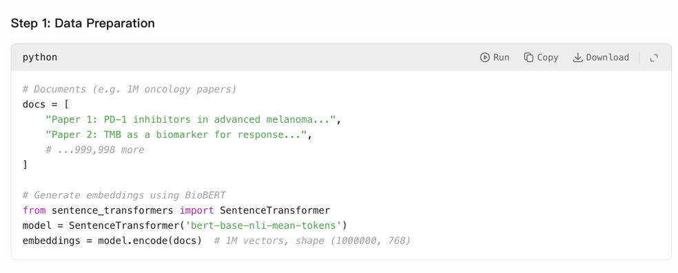
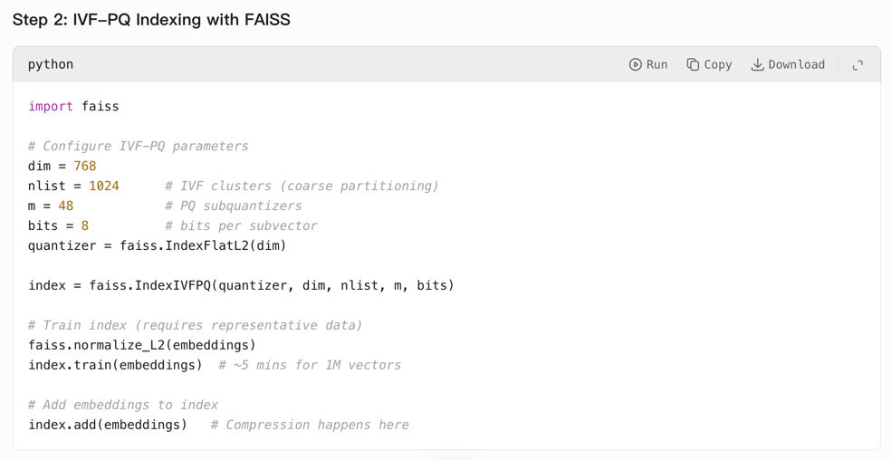
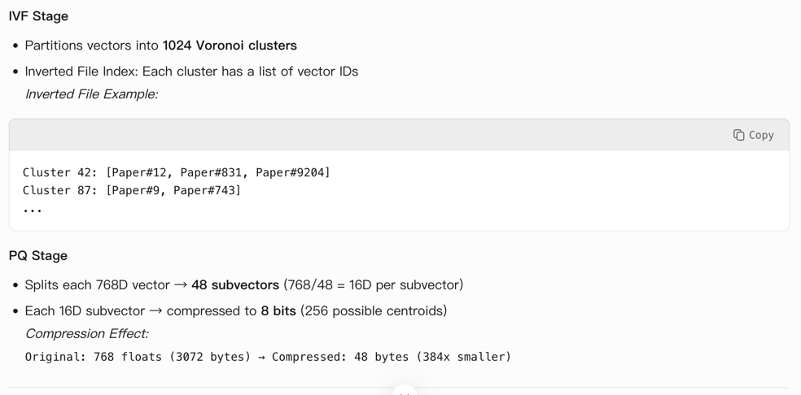
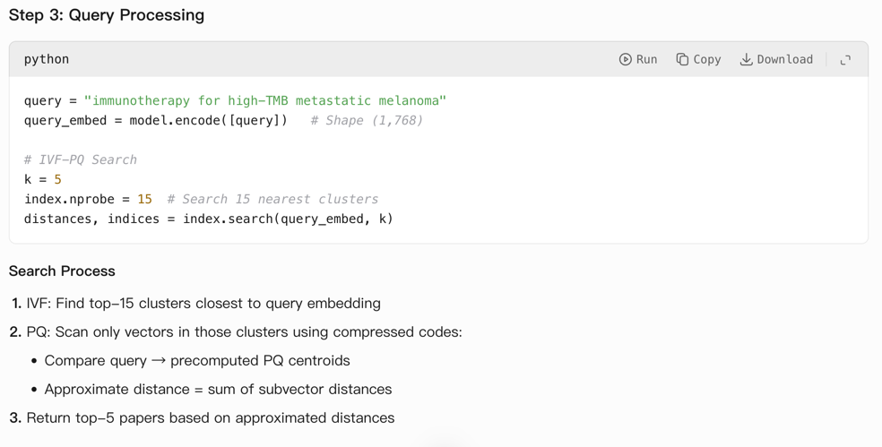
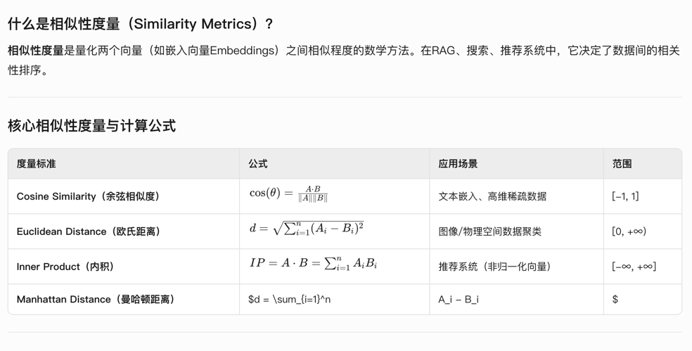
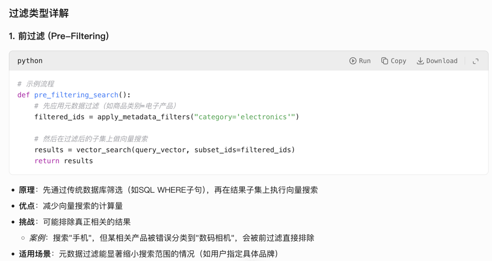
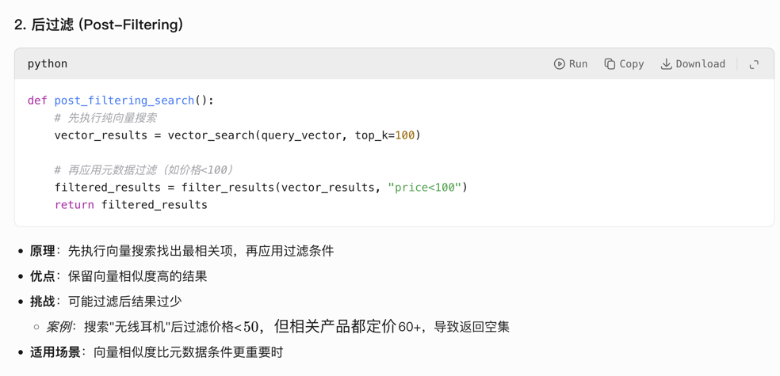
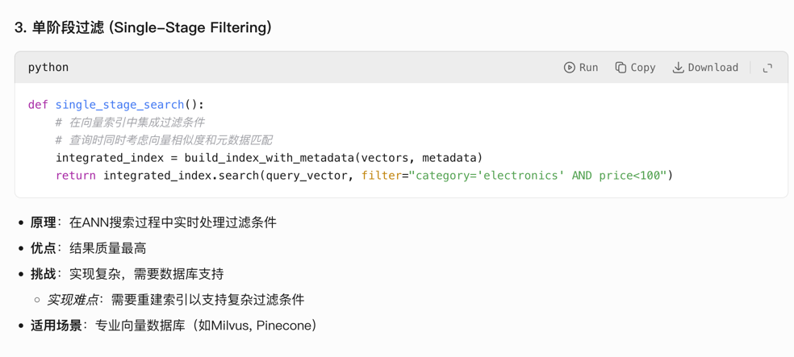

# What is a vector database?

A vector database is a specialized database management system designed to store, index, and query vector embeddings - numerical representations of data in high-dimensional space (typically 128-2048 dimensions). Unlike traditional databases that handle structured data, vector databases excel at similarity search operations where the goal is to find items "close" to a query vector based on mathematical distance metrics. The core components include:

1. **Vector Storage Engine**: Efficiently stores dense vectors with associated metadata
2. **Indexing System**: Creates optimized data structures for fast similarity search
3. **Query Processor**: Handles nearest neighbor search operations
4. **Distance Metrics**: Implements algorithms like cosine similarity, Euclidean distance, and inner product

Vector databases are fundamental to AI applications because they enable:
- Semantic search across unstructured data
- Retrieval-Augmented Generation (RAG) systems
- Real-time recommendation engines
- Anomaly detection through outlier identification

# How does a vector database differ from traditional databases?

Vector databases differ from traditional relational/SQL databases in these key aspects:

| **Dimension**         | **Vector Database**                  | **Traditional Database**       |
|------------------------|--------------------------------------|--------------------------------|
| **Data Type**          | High-dimensional vectors             | Structured tables/relations    |
| **Primary Operation**  | Similarity search (k-NN)             | Exact match queries            |
| **Indexing Method**    | Approximate Nearest Neighbor (ANN)   | B-tree, Hash indexes           |
| **Query Language**     | Vector similarity operators          | SQL                            |
| **Optimization Focus** | Distance computation efficiency      | Join optimization, ACID compliance |
| **Use Cases**          | Semantic search, AI recommendations  | Transaction processing, CRUD   |
| **Scalability**        | Horizontal scaling for read-heavy loads | Vertical scaling for write consistency |

Key technical differences:
- **Data Representation**: Vectors vs. rows/columns
- **Query Paradigm**: "Find similar" vs. "Find exact match"
- **Performance Characteristics**: Optimized for parallel distance computations rather than complex joins
- **Consistency Models**: Often eventual consistency vs. strong consistency

# How does a vector database work?

Vector databases operate through a four-stage processing pipeline:

1. **Ingestion & Vectorization**
   ```
   raw_data → [Embedding Model] → vector_embeddings
   ```
   - Converts text/images/audio into dense vectors
   - Attaches metadata (source, timestamps, etc.)

2. **Indexing**
   - Builds specialized data structures:
     ```
     # Common index types
     HNSW (Hierarchical Navigable Small World) - balance of speed/accuracy
     IVF (Inverted File Index) - high recall with quantization
     LSH (Locality-Sensitive Hashing) - approximate hashing
     ```
   - Optimizes for specific distance metrics (cosine/Euclidean)

3. **Query Processing**
   - Receives query vector
   - Executes approximate nearest neighbor search:
     ```
     results = index.query(query_vector, top_k=5, distance_threshold=0.7)
     ```
   - Filters results using metadata (e.g., date ranges, categories)

4. **Result Refinement**
   - Reranks candidates using post-processing
   - Formats output with scores and metadata

# Explain difference between vector index, vector DB & vector plugins?

**Vector Index**: Algorithmic structure for efficient similarity search
- Examples: FAISS, HNSW, Annoy
- Function: Pure search acceleration
- Scope: Library-level component

**Vector Database**: Full-stack solution for vector management
- Components: Storage + Indexing + Query Engine + API
- Features: Persistence, scalability, security
- Examples: Pinecone, Weaviate, Milvus

**Vector Plugins**: Extensions to existing databases
- Implementation: Add vector capabilities to traditional DBs
- Examples: 
   ```
   PostgreSQL → pgvector extension
   Elasticsearch → dense_vector field type
   Redis → RedisVL module
   ```
- Use Case: Adding vector search to established data infrastructure

# You are working on a project that involves a small dataset of customer reviews. Your task is to find similar reviews in the dataset. The priority is to achieve perfect accuracy in finding the most similar reviews, and the speed of the search is not a primary concern. Which search strategy would you choose and why?

For this scenario with a small dataset (<10,000 reviews) where accuracy is paramount and speed is not critical, I would select **Exhaustive Search (Brute-Force k-NN)**. 

Implementation:
```
def find_similar(query_vector, all_vectors):
    results = []
    for vector in all_vectors:
        distance = cosine_similarity(query_vector, vector)
        results.append((vector, distance))
    return sorted(results, key=lambda x: x[1], reverse=True)[:k]
```

**Why this approach?**
1. **Perfect Accuracy**: Computes exact distances to all vectors
2. **Simplicity**: No approximation errors from indexing
3. **Small Data Advantage**: Computational cost O(N) is manageable at small scale
4. **No Indexing Overhead**: Avoids index construction/tuning complexity
5. **Implementation Simplicity**: ~10 lines of Python with NumPy

**Performance Consideration**: 
- For 10,000 vectors (768-dim): ~150ms on modern CPU
- Scales linearly but remains practical under 50k vectors

**When to avoid**: 
- Dataset sizes >100k vectors
- Real-time latency requirements <50ms

# Explain vector search strategies like clustering and Locality-Sensitive Hashing.

### Clustering-Based Search (e.g., IVF - Inverted File Index)

**Mechanism**:
1. Cluster vectors into Voronoi cells during indexing
2. Store inverted index mapping centroids → vectors
3. At query time:
   ```
   a. Find nearest centroids to query
   b. Search only vectors in those cells
   ```

**Pros**: 
- Reduces search space significantly
- Tunable via n_probe parameter (more cells → higher accuracy)

**Cons**: 
- Quantization error from cell boundaries
- Requires training phase

### Locality-Sensitive Hashing (LSH)

**Mechanism**:
1. Create hash functions where similar vectors collide
   ```
   hash_bucket = floor((vector • random_hyperplane) / bucket_width)
   ```
2. Build multiple hash tables with different hyperplanes
3. Query process:
   ```
   candidates = union of vectors in query's hash buckets
   refine candidates with exact distance
   ```

**Pros**:
- Sublinear query time O(N^ρ) where ρ<1
- Naturally parallelizable

**Cons**:
- Accuracy/recall tradeoff
- Requires careful tuning of parameters

**Visual Comparison**:
```
Clustering: [Cell1] [Cell2] [Cell3] → Search Cell2 + neighbors
LSH: Hash Tables → Candidate buckets → Refine
```

# How does clustering reduce search space? When does it fail and how can we mitigate these failures?

### Search Space Reduction Mechanism
Clustering partitions the vector space into regions (Voronoi cells) centered around centroids. During search:
1. Compute distance from query to centroids
2. Select nearest centroids (e.g., n_probe=3)
3. Only search vectors within selected cells

**Reduction Factor**:
- For k clusters and n_probe selected:
   ```
   search_space = (n_probe / k) * total_vectors
   ```
- Example: 1M vectors, 1024 clusters, n_probe=8 → ~8,000 vectors searched (0.8%)

### Failure Cases and Mitigations

1. **Boundary Failure**  
   - Problem: Near-cell-boundary vectors missed  
   - Mitigation: Increase n_probe (search more cells)  

2. **Centroid Drift**  
   - Problem: Data distribution changes over time  
   - Mitigation: Periodic reindexing + online centroid adjustment  

3. **High-Dimensional Curse**  
   - Problem: Clusters become less effective in >500 dimensions  
   - Mitigation: Dimensionality reduction (PCA, UMAP)  

4. **Non-Uniform Distribution**  
   - Problem: Vectors clustered unevenly  
   - Mitigation:  
     ```
     a. Adaptive clustering (increase centroids in dense regions)  
     b. Hierarchical IVF (cluster within clusters)  
     ```

5. **Query-Centric Mismatch**  
   - Problem: Query near cluster edge but centroids far  
   - Mitigation:  
     ```
     Query-Aware Selection:  
     search_cells = find_cells_within_radius(query, radius)
     ```

**Performance-Accuracy Tradeoff**:
```
n_probe ↑ → Accuracy ↑ → Speed ↓
Number_of_clusters ↑ → Accuracy ↑ → Memory ↑
```

# Explain Random projection index?

Random Projection (RP) is a dimensionality reduction technique that projects high-dimensional vectors into a lower-dimensional space using random matrices. The core concept relies on the Johnson-Lindenstrauss lemma, which guarantees that pairwise distances are approximately preserved with high probability.

```
# Mathematical foundation
Given original vector v ∈ ℝ^d
Random matrix R ∈ ℝ^{k×d} (k << d)
Projected vector: v' = R • v ∈ ℝ^k
```

**Key properties**:
1. Distance preservation: (1-ε) ||u-v||² ≤ ||R(u)-R(v)||² ≤ (1+ε) ||u-v||²
2. Construction: Elements sampled from N(0,1/k) or sparse distributions
3. Implementation workflow:
   ```
   Precompute random matrix R
   For each vector: v_projected = dot(R, v)
   Build index on projected vectors
   ```

**Advantages**:
- Reduces storage by 4-8x
- Accelerates distance computations
- Simple implementation with NumPy/SciPy

**Limitations**:
- Fixed projection lacks adaptability
- Accuracy loss (3-8% recall drop)

# Explain Locality-sensitive hashing (LSH) indexing method?

Locality-Sensitive Hashing (LSH) is an approximate nearest neighbor technique that hashes similar vectors into the same buckets with high probability. The core principle is:

```
Pr[h(a) = h(b)] ∝ similarity(a,b)
```

**Implementation types**:
1. Hyperplane LSH (cosine similarity):
   ```
   h(v) = sign(dot(r, v)) 
   r ~ N(0,I)
   ```
2. p-Stable LSH (Euclidean distance):
   ```
   h(v) = floor((dot(r,v) + b)/w)
   r ~ N(0,I), b ~ Uniform[0,w]
   ```

**Indexing process**:
1. Construct L hash tables
2. For each vector:
   ```
   for i in range(L):
        key = concatenate_hashes(v)
        add to table_i[bucket_key]
   ```

**Advantages**:
- Sublinear query time O(N^ρ)
- Naturally parallelizable
- Supports dynamic updates

**Limitations**:
- Memory-intensive
- Parameter sensitivity requires tuning

# Explain product quantization (PQ) indexing method?

Product Quantization (PQ) decomposes vectors into subvectors and quantizes each subspace separately:

```
v ∈ ℝ^D → [v₁, v₂, ..., v_M] where v_i ∈ ℝ^{D/M}
For each subspace:
    Learn codebook via k-means
    Quantize v_m → nearest centroid
```

**Variants**:
1. IVF-PQ: Coarse quantizer + PQ
2. OPQ: Optimized with rotation matrix
   ```
   R = optimize_rotation(training_data)
   v_rotated = dot(R, v)
   ```

**Performance**:
- Compression ratio: 16-32x
- Memory efficient: Stores centroid IDs
- Query speed: 10-100x faster than brute force

**Limitations**:
- Irrecoverable quantization error
- Training overhead
- Degrades with uncorrelated dimensions

# Compare different Vector index and given a scenario, which vector index you would use for a project?

### Vector Index Comparison
| **Index** | **Accuracy** | **Speed** | **Memory** | **Best For** |
|-----------|--------------|-----------|------------|--------------|
| HNSW | ★★★★★ | ★★★★☆ | Medium | High recall applications |
| IVF | ★★★★☆ | ★★★★★ | Low | Large-scale deployments |
| LSH | ★★★☆☆ | ★★★★☆ | High | Dynamic datasets |
| PQ | ★★★☆☆ | ★★★★★ | Very Low | Memory-constrained systems |
| Brute-Force | ★★★★★ | ☆ | Very High | Small datasets (<10K) |

### Recommendation System Scenario
**Requirements**:
- 100M product embeddings
- <50ms latency
- 95% recall@10
- Frequent updates

**Selected Index**: IVF_PQ  
**Why**:
1. Handles scale via sharding
2. PQ reduces memory 16x
3. IVF provides fast approximate search
4. Supports incremental updates







# How would you decide ideal search similarity metrics for the use case?

Use this decision framework:



```
Step 1: Data Modality Analysis
Text → Cosine Similarity
Images → Euclidean Distance
Recommendations → Inner Product
Cross-Modal → Cosine

Step 2: Task Requirements
Ranking → Cosine/IP
Clustering → Euclidean
Anomaly Detection → Mahalanobis

Step 3: Embedding Space Validation
Test with triplet validation:
d(pos, anchor) < d(neg, anchor)
```

**Workflow**:
```
graph TD
    A[Data Type] --> B{Text?}
    B -->|Yes| C[Cosine]
    B -->|No| D{Images?}
    D -->|Yes| E[Euclidean]
    D -->|No| F[Inner Product]
```

# Explain different types and challenges associated with filtering in vector DB?

### Filtering Types
1. **Pre-Filtering**:
   ```
   Apply metadata filters → Vector search on subset
   ```
   Challenge: May exclude relevant vectors


2. **Post-Filtering**:
   ```
   Vector search → Apply metadata filters
   ```
   Challenge: May return insufficient results


3. **Single-Stage Filtering**:
   ```
   Integrated during ANN search
   ```
   Challenge: Implementation complexity


### Key Challenges
1. **Filter Cardinality Impact**:
   - High-selectivity filters → few results
   - Mitigation: Hybrid pre/post filtering

2. **Multi-Field Constraints**:
   ```
   WHERE price < 100 AND category = 'electronics'
   ```
   Solution: Bitmap indexing

3. **Dynamic Range Filters**:
   Solution: KD-tree for spatial attributes

4. **Filter-Vector Interaction**:
   Solution: Learn ranking function:
   ```
   score = α•similarity + β•filter_match
   ```

sample search engine code:
```python

# 电商搜索完整流程
def search_products(query, filters):
    # 1. 查询理解
    query_vector = embed_text(query)
    
    # 2. 混合过滤
    low_cardinality_ids = apply_filters(get_low_cardinality_filters(filters))
    
    # 3. 带过滤的向量搜索
    vector_results = vector_search(
        query_vector, 
        subset_ids=low_cardinality_ids,
        top_k=1000
    )
    
    # 4. 应用高基数过滤
    filtered_results = apply_high_cardinality_filters(vector_results, filters)
    
    # 5. 综合排序
    ranked_results = ranking_model.sort(filtered_results)
    
    # 6. 结果后处理
    return paginate_results(ranked_results)

```

# How to decide the best vector database for your needs?

Use this 10-factor evaluation:

### Decision Matrix
| **Factor** | **Evaluation Method** | **Key Considerations** |
|------------|------------------------|-------------------------|
| Data Scale | Test with 2x production data | Max shard size |
| Latency | Benchmark p95/p99 | HNSW vs IVF tradeoffs |
| Accuracy | Measure recall@k | Quantization impact |
| Metadata | Complex filter queries | Geo/range support |
| Updates | CRUD benchmarks | Real-time vs batch |

### Scoring System
1. Weight factors (0-10) by priority
2. Rate databases (1-5 stars)
3. Calculate:
   ```
   total_score = ∑(weight × rating)
   ```

### Recommendation Workflow
```
graph LR
    A[<100K] --> B[pgvector]
    A --> C[Chroma]
    D[100K-10M] --> E[Weaviate]
    D --> F[Qdrant]
    G[>10M] --> H[Pinecone]
    G --> I[Milvus]
```

### Horizontal Comparison

| **Database** | **Scalability**          | **Performance**                    | **Key Features**                                  | **Best For**                       |
| ------------ | ------------------------ | ---------------------------------- | ------------------------------------------------- | ---------------------------------- |
| **Milvus**   | ★★★★☆ (Billion+ vectors) | 100-500 QPS (2000 万 768 维向量) 3 | Multi-index (HNSW/IVF), GPU 加速, 分布式架构      | 企业级大规模 AI 系统、多模态搜索   |
| **Qdrant**   | ★★★★☆ (100M+ vectors)    | 100-400 QPS (2000 万向量) 3        | Rust 开发, 实时更新, 强过滤支持, REST/gRPC API    | RAG 系统、实时推荐、结构化数据检索 |
| **Pinecone** | ★★★☆☆ (Managed 云服务)   | 低延迟 (托管优化) 1                | 全托管服务, 单阶段元数据过滤, 无缝云集成          | 快速部署生产级推荐系统/语义搜索    |
| **Weaviate** | ★★★☆☆ (10M-100M)         | 中等延迟 5                         | 混合检索(向量+关键词), GraphQL 接口, 知识图谱支持 | 语义搜索、复杂查询场景             |
| **Chroma**   | ★☆☆☆☆ (<1M 向量)         | 轻量级快速原型 6                   | Python 嵌入式, LangChain 集成, 简单 API           | 原型开发/POC、小型项目             |
